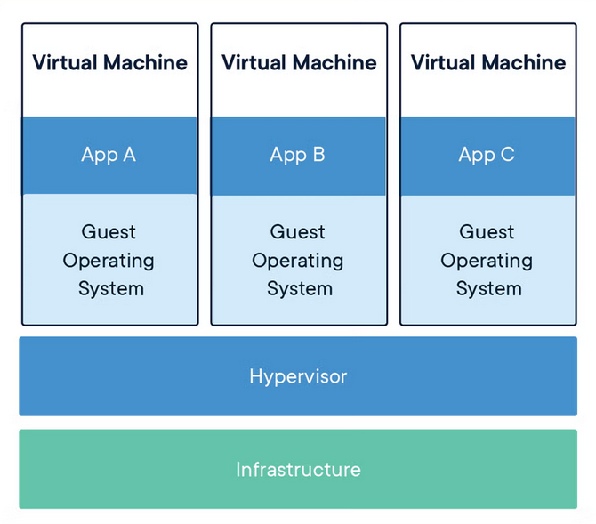
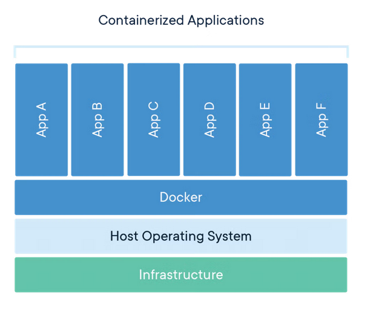

# Virtualization and Containers

## Virtualization

The process of creating a virtual version of a computer—commonly referred to as a VM (virtual machine).

### Virtual Machine

A VM is a software-based simulation of a physical computer. A hypervisor allows multiple VMs to run on a single machine. Each VM includes a full copy of an operating system, applications, and the necessary binaries and libraries—often taking up tens of gigabytes. VMs can also be slow to boot.

### Benefits of VMs

- **Isolation**  
  Each VM operates independently with its own operating system and applications. This isolation enhances security and ensures that issues in one VM do not affect others.

- **Sustainability**  
  VMs optimize hardware usage, reducing the need for physical servers.

- **Cost Efficiency**  
  By consolidating multiple virtual servers onto a single physical machine, organizations can reduce hardware, maintenance, and operational costs.

- **Scalability and Flexibility**  
  VMs can be easily created, cloned, or deleted, allowing quick adjustments to computing needs. Resources can be scaled up or down with minimal effort.

- **Cross-Platform Capability**  
  VMs enable running multiple operating systems on the same physical hardware.

---

## Containers

Containers are an abstraction at the application layer that package code and dependencies together. Multiple containers can run on the same machine and share the host OS kernel, each running as isolated processes in user space. Containers take up less space than VMs (container images are typically tens of megabytes in size).

### Benefits of Containers

- **Isolation between applications**
- **Portability and reproducibility**
- **Fast startup times**
